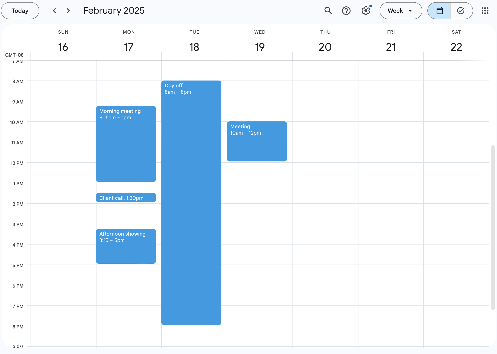
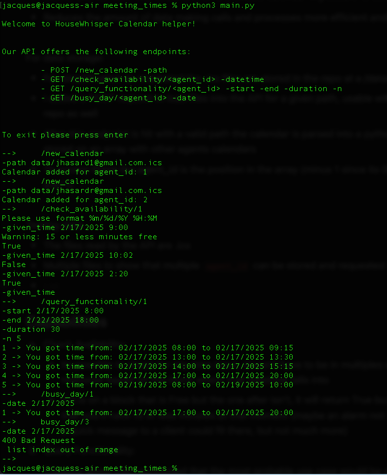

# Meeting times API

## Decisions

This exercise is modeled as an API that would be used by the real estate agent to:

-   Check his own availability at a certain date and time for a call or a showing
-   Find different date time options to share with a client when arranging a meeting or call
-   Check if there’s enough time on a given day to fit more work

Given these use cases I decided to split time in 15 minutes blocks:

-   While 15 minutes are not enough for a showing, it could be for a call
-   Blocks shorter than this could end on a crowded calendar impossible to accomplish
-   Reduces the amount of data making calls and processes more efficient and light weight

For data storage:

-   For simplification the .ics files are stored in the repo at a /data folder
-   I added a `POST` request to load files into the API for a given path, usable with files outside the repo as well
-   After this endpoint is hit with a valid path the calendar is parsed into a python dictionary stored on an array with other agents calendars
-   To access these the agent_id is the position in the array (minus 1 since its 0-indexed and ids aren’t)

Testing data:

-   The files read by the API are .ics
-   Multiple files to show that multiple `agent_id` can be stored and requested
-   Explanation
    -   One day with intervals and at least one longer than 1:30 to show `check_availability` , `query_functionaility` on a day with time between meetings and `busy_day` when its not busy
    -   a day blocked from 8am to 8pm to show `busy_day` when there its actually busy
    -   day with one meeting for multiple day `query_functionaility` requests

## Capabilities

1. Check Availability:
    - It's possible to check for any time input, doesn’t have to be in multiples of 15 minutes. The response is based on the block where that `datetime` falls into (example 10:32 falls into the 10:30-10:45 block)
    - If it is on a block that is free but the one after isn’t, it will return True but with a warning that you’ll have 15 or less minutes at that moment (maybe an alarm not to forget to deliver a quick message to a client could fit there, but not much more)
2. Query Functionality:

    Thinking about this I concluded that the most probable use case would be asking the API for _n_ options to give to a client for a certain duration.

    For example, a client asks to see a certain house during the next week, lets say for this house the agent knows he needs an hour. I decided that it was more useful to give any blocks available larger or equal than an hour instead of giving either times every 15 minutes or one after the other.

    Lets say I have 2 hours free between 8am and 10am, instead of giving:

    - 8:00-9:00
    - 8:15-9:15
    - 8:30-9:30
    - 8:45-9:45
    - 9:00-10:00

    Or:

    - 8:00-9:00
    - 9:00-10:00

    The API returns that they have free time in their calendar **from 8:00-10:00** to give that option to the client for him to decide one hour in that given timeframe.

    I also restricted working hours from 8am to 8pm, I know real estate agents may have showings on weekends or after a regular 9-5, at the end their customers are most probably working on those hours on weekdays.

3. Identify if a specified day is not busy for an agent:

    For this last capability I tried to think as an agent, how much time is too much free time? and then I thought, not necessarily on the total of the day, but free continuous time. I could have several 15 minute breaks in between meetings or calls, but that doesn’t mean its a day that could take more load.

    I decided that if there was at least one 1:30 block of free time on a day from 8 am to 8 pm, that meant that they could take some more work load on that day to arrange a meeting or call.

    The function returns the first 1:30 block found in that day if there is one, if not it returns `None`.

## Possible improvements

-   Option to block certain days or working hours
-   Option to decide how much is a continuous free-time block for the busy day capability
-   More detailed and robust error handling
-   Due to the API required capabilities the only information being saved is the event name, for future work with more use cases a class should be implemented where more information could be saved with a good structure (location, notes, participants, links, status, among others)

## How to run it

Clone repo and run in terminal with `python3 main.py`

Example run

